# Rock, Paper, Scissors, Lizard, Spock

Rock, Paper, Scissors, Lizard, Spock, invented by Sam Kass, is an adaptation of the traditional game of chance, Rock, Paper, Scissors. It was popularized by Dr. Sheldon Cooper from "The Big Bang Theory".

In "The Lizard-Spock Expansion" episode, it is first used to resolve a TV-watching disagreement between Sheldon and Raj.

- The rules for this game are:

The player picks a variable and reveals it simultaneously as the pc. The winner is the one who gets 10 points first. In a tie, the process is repeated until a winner is found.

Scissors cuts Paper, Paper covers Rock, Rock crushes Lizard, Lizard poisons Spock, Spock smashes Scissors, Scissors decapitates Lizard, Lizard eats Paper, Paper disproves Spock, Spock vaporizes Rock, (and as it always has) Rock crushes Scissors.

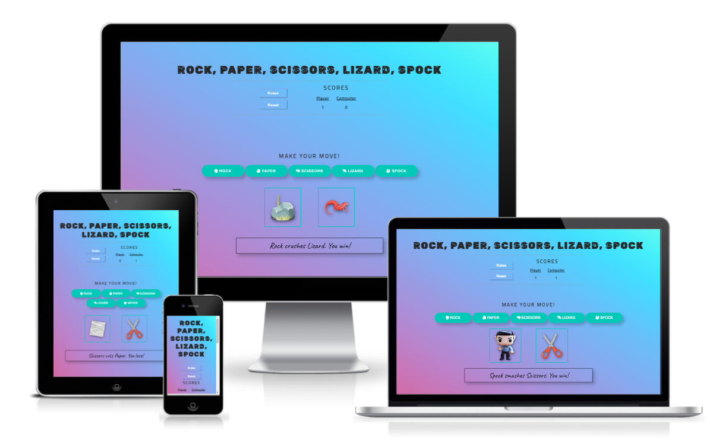

The Live Game can be accessed [HERE!](https://carmencantudo.github.io/rock-paper-scissors-lizard-spock/)

 

## Table of Contents
- [Rock, Paper, Scissors, Lizard, Spock](#rock-paperscissors-lizardspock)
  - [Table of Contents](#table-of-contents)
  - [Features](#features)
    - [Existing Features](#existing-features)
    - [Future Features](#future-features)
  - [UX](#ux)
    - [Site Purpose](#site-purpose)
    - [Site Goal](#site-goal)
    - [Audience](#audience)
    - [Communication](#communication)
    - [Current User Goals](#current-user-goals)
    - [New User Goals](#new-user-goals)
    - [Site Administrator Goals](#site-administrator-goals)
  - [Design](#design)
    - [Colour Scheme](#colour-scheme)
    - [Typography](#typography)
    - [Imagery](#imagery)
    - [Wireframes](#wireframes)
  - [Testing](#testing)
    - [Validator Testing](#validator-testing)
  - [Technologies Used](#technologies-used)
    - [Main Languages Used](#main-languages-used)
    - [Frameworks, Libraries \& Programs Used](#frameworks-libraries--programs-used)
  - [Deployment](#deployment)
    - [Using GitHub Pages](#using-github-pages)
    - [How to Fork it](#how-to-fork-it)
    - [How to Clone it](#how-to-clone-it)
    - [Making a Local Clone](#making-a-local-clone)
  - [Credits](#credits)
    - [Media](#media)
    - [Code](#code)

## Features
### Existing Features

 Header 

The Header at the top of the page features a contrasting font that makes it stand out and prominently displays the game's title.

 The Rules, Reset button and Score Area 

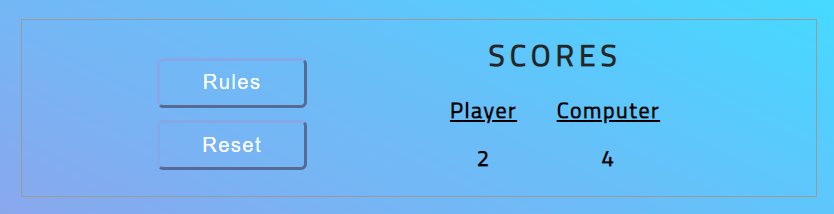

- Rules button:

The modal gives a short overview of the game rules.
The modal contains a close button, which the user can use to close it.
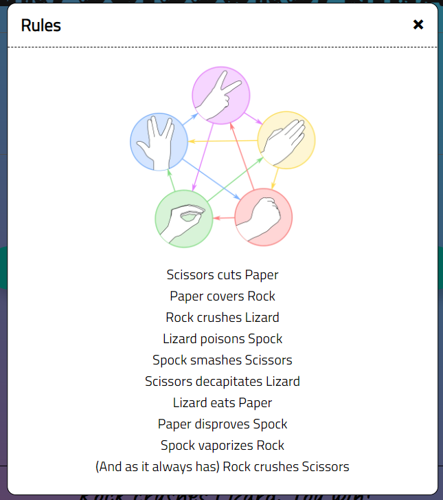

- Reset button:
  
When clicked, it resets the scores to 0 and removes the choices and the result from the game area.

- Scores area:

The player's score is on the left, increasing after each player's win.
The right shows the computer's score, which also updates after each win.

 Choices Area 

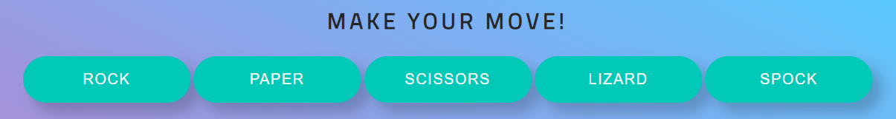

The following section contains the game options that the player can select: Rock, Paper, Scissors, Lizard, Spock.
The computer initiates an automatic random play when the player clicks on one option.

The printed name and a Font Awesome icon are used to assist the user in learning the hand movements often associated with the game.

Each button also includes a hoover and an active element for the assistance of users.

 User vs Computer Area 

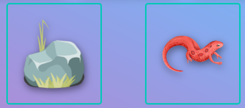

The left box displays the player's choice, while the right box displays the computers. This facilitates comparison.

The chosen option displays a humorous picture of the real choice.

 Result message Area 

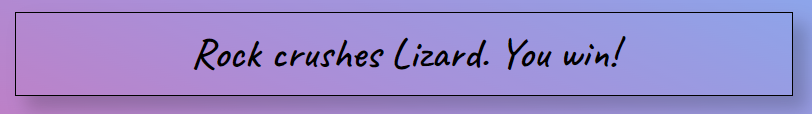

The winning decision based on the game's rules is also displayed after each round.
It's also beneficial for inexperienced users because they may learn the game's rules while they play.

### Future Features

- To store the scores and add a player name, click here.
- To ensure return and new visitors by sharing their high scores or victories on social media.

[Back to top](#rock-paper-scissors-lizard-spock)

## UX
### Site Purpose
Rock, paper, scissors, lizard, Spock is a website that aims to explain how pure JavaScript works. The objective is to build a fun, interactive website for individuals of all ages.

Users may play a fun and exciting game of Rock, Paper, Scissors, Lizard, and Spock against the computer, and after each round, they will clearly know who won and got the point. When 10 points are reached, the winner is announced.

### Site Goal
- To offer a user-friendly game that is simple to play and comprehend.
- To develop a visually appealing and well-designed game.
- To produce code that complies with best practices.
- To provide clear and concise information about the rules.

### Audience
- Despite being available to all players, "The Big Bang Theory" fans will love this game because it was inspired by the popular TV program.
- On all platforms, the game is simple to explore and play. The game has simple rules and a clear message. It is entertaining and competitive, and it runs flawlessly.
The colours in the game are bright and crisp.
- I want to utilise the website efficiently as a first-time visitor and clearly understand what it is intended to do. I want to play a game naturally, even if the rules are provided.
- As a user, I want the game's design to be elegant and modern. To know who is winning or losing, I need to visualize the game's scores. 
- As a returning user, I may have fun playing the game when I'm on the move or in my own time.

### Communication
The website's detailed design makes the information easily accessible to all visitors. Without having to conduct a thorough search, the information is readily available.

### Current User Goals

### New User Goals

### Site Administrator Goals

[Back to top](#rock-paper-scissors-lizard-spock)

## Design
### Colour Scheme
The colour scheme was designed to follow the background gradient colours. The css gradient was created using [ColorSpace](https://mycolor.space/).

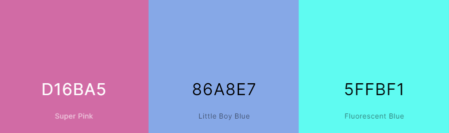

### Typography
- Rubik Moonrocks: Used for the game title.
- Titillium Web: For the body.
- Caveat: For result message.

### Imagery
The site's images were gathered from free stock photo websites, and the sources are listed in the Credits section. Each photo provided supports the site's theme.

### Wireframes
- Desktop
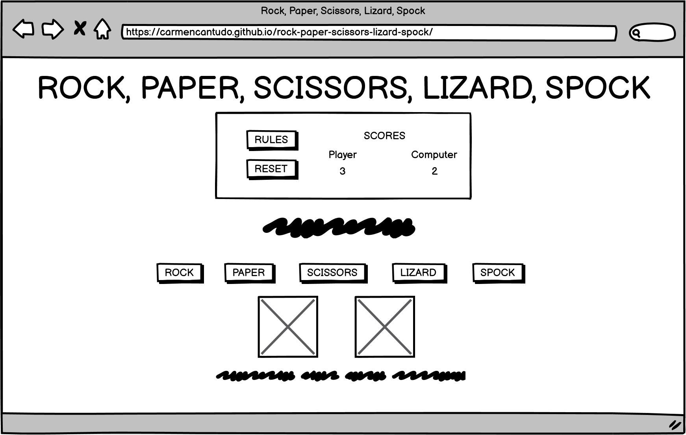

- Tablet
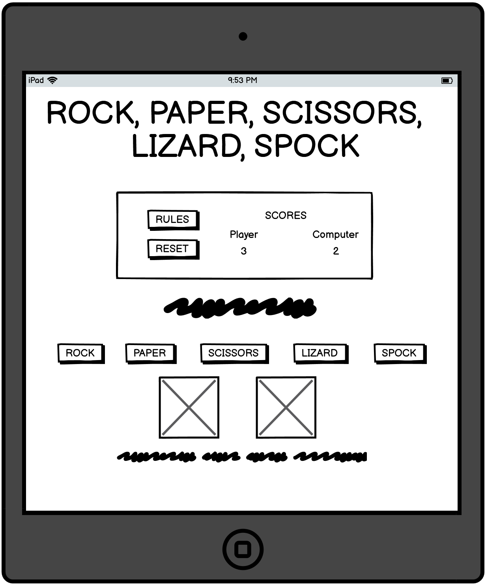

- Mobile
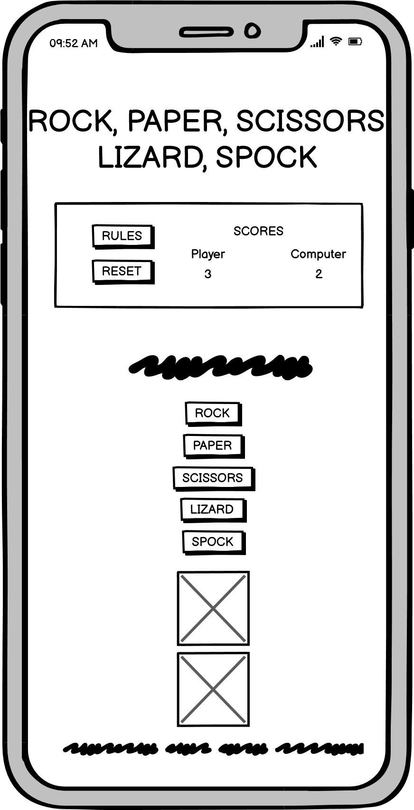

[Back to top](#rock-paper-scissors-lizard-spock)

## Testing

- The website was constantly tested during development using Chrome dev tools.
- Tested all buttons.
- Website tested in Chrome, Firefox, Microsoft Edge, and Brave.
- Lighthouse was used to test the website for Performance, Accessibility, Best Practices and SEO for desktop and mobile:
  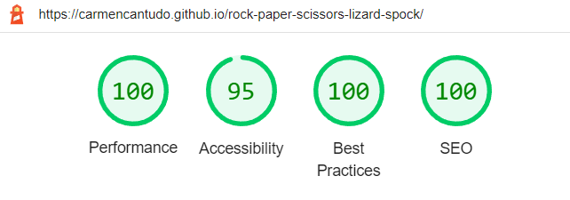

### Validator Testing
- HTML
  - No errors were returned when passing through the official [W3C validator](https://validator.w3.org/nu/?doc=https%3A%2F%2Fcarmencantudo.github.io%2Frock-paper-scissors-lizard-spock%2F).
  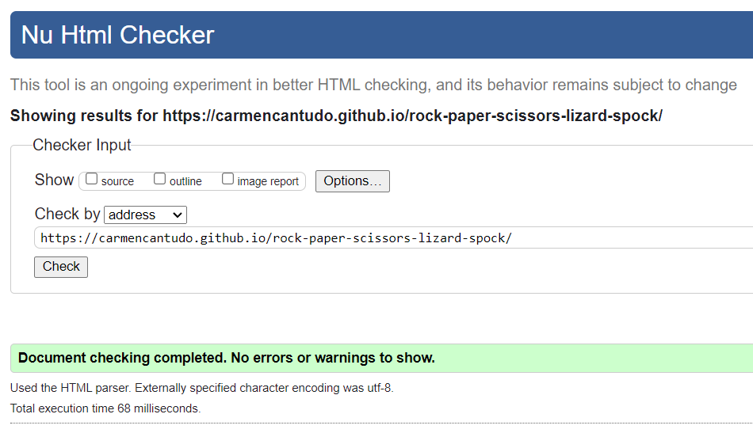
- CSS
  - No errors were found when passing through the official [(Jigsaw) validator](https://jigsaw.w3.org/css-validator/validator?uri=https%3A%2F%2Fcarmencantudo.github.io%2Frock-paper-scissors-lizard-spock%2F&profile=css3svg&usermedium=all&warning=1&vextwarning=&lang=en).
  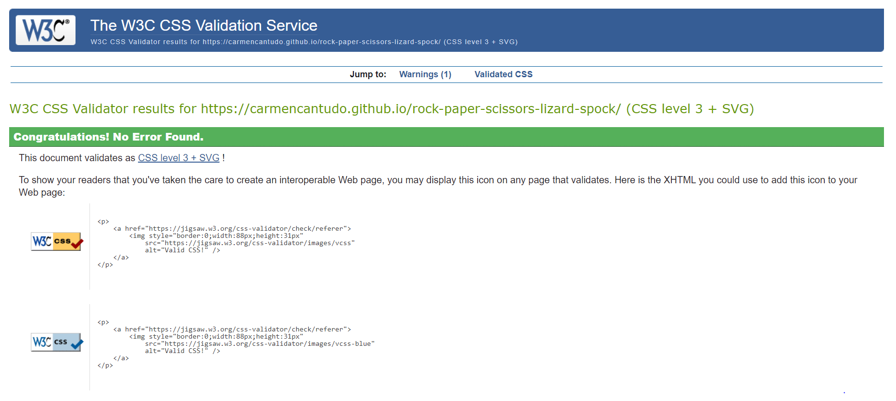
-Javascript
  - JavaScript was tested using [Beautifytools](https://beautifytools.com/javascript-validator.php).
  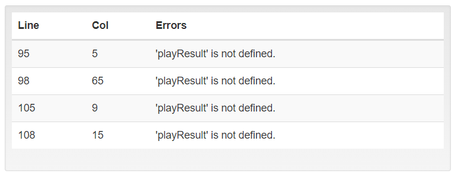

[Back to top](#rock-paper-scissors-lizard-spock)

## Technologies Used

### Main Languages Used
- HTML5: Provides the structure and content for the website.
- CSS3: Provides the website styling.
- JavaScript: To create an interactive game that allows users to interact with data.

### Frameworks, Libraries & Programs Used
- [Gitpod](https://gitpod.io/): to create my Html file, styling sheet, and Javascript before pushing the project to GitHub.
- [GitHub](https://github.com/): to store my repository for submission.
- [Balsamiq Wireframes](https://balsamiq.com/): to make the wireframes for the website.
- [Google Fonts](https://fonts.google.com/): for the font families, Caveat, Rubik Moonrocks, Titillium Web.
- [Am I Responsive?](https://ui.dev/amiresponsive): to ensure the project looked good across all devices.
- [Markdown cheat sheet](https://www.markdownguide.org/cheat-sheet/): to complete the Readme.
- Google Chrome DevTools – Used to debug and evaluate the site's responsiveness.

[Back to top](#rock-paper-scissors-lizard-spock)

## Deployment

### Using GitHub Pages
In the GitHub Repository from the project https://github.com/CarmenCantudo/rock-paper-scissors-lizard-spock

1. Click the 'Settings' Tab.
2. Scroll Down to the Git Hub Pages Heading.
3. Select 'Main Branch' as the source.
4. The Page will reload 'Settings' again.
5. Scroll to GitHub pages heading and there will now be a clickable link https://carmencantudo.github.io/rock-paper-scissors-lizard-spock/
6. Click the link for the live deployed page.

### How to Fork it
1. On GitHub, go to [CarmenCantudo/rock-paper-scissors-lizard-spock](https://github.com/CarmenCantudo/rock-paper-scissors-lizard-spock).
2. In the top right, click "Fork".

### How to Clone it
1. Go to the main page of the repository.
3. Above the file list, click "Code".
4. Select HTTPS, SSH, or GitHub CLI and then click copy to clone it.
5. Open Git Bash.
6. Change the location of your cloned repository.
7. Type `git clone` and then paste the URL you copied.
8. Press “Enter” to create your clone.

### Making a Local Clone
1. Locate the [Repository](https://github.com/CarmenCantudo/rock-paper-scissors-lizard-spock).
2. Click "Code".
3. Click Clone or Download.
4. Copy the Git URL from the dialogue box.
5. Open a terminal window in your choosen directory using your preferred development editor.
6. Change the location to where you want the cloned directory to be.
7. Type `git clone`, and then paste the URL you copied.
8. Press Enter, and your local clone will be created.

[Back to top](#rock-paper-scissors-lizard-spock)

## Credits
### Media
The following images are from [Freepick](https://www.freepik.com/) and [Pixabay](https://pixabay.com/):
- Lizard: [Sticker template created by photographeeasia](https://www.freepik.com/free-vector/sticker-template-with-reptiles-amphibians-animal-concept-watercolor-style_22524760.htm)
- Rock: [Rocks with grass created by macrovector](https://www.freepik.com/free-vector/rocks-with-grass-stones-green-grass-nature-rock-illustration-outdoor-environment-plant-vector-vector-rocks-vector-stones_10603746.htm)
- Scissors: [Back to school set icons created by stockgiu](https://www.freepik.com/free-vector/back-school-set-icons_4985031.htm)
- Paper: [Wrinkled paper vector created by rawpixel.com](https://www.freepik.com/free-vector/blank-paper-collage-background_16396988.htm)
- Spock: [Spock created by brenkee](https://pixabay.com/photos/spock-star-trek-vulcan-1541528/)
- Game moves: [Rock, Paper, Scissors, Lizard, Spock moves](https://bigbangtheory.fandom.com/wiki/Rock,_Paper,_Scissors,_Lizard,_Spock?file=RPSLS.png)
- Favicon: [Rock Paper Scissors Icon](https://icon-library.com/icon/rock-paper-scissors-icon-6.html)

### Code
Resources used in the process of the Rock, Paper, Scissors, Lizard, Spock game design and build:
- Flexbox: [A Complete Guide to Flexbox](https://css-tricks.com/snippets/css/a-guide-to-flexbox/)
- Body background gradient: [ColorSpace](https://mycolor.space/)
- Matrix: [How to Code: Rock, Paper, Scissors, Lizard, Spock in JavaScript](https://youtu.be/BjDZFfBWQ-0)
- Popup modal: [Build a Popup With JavaScript](https://youtu.be/MBaw_6cPmAw)
- Icons taken from: [Font Awsome Library](https://fontawesome.com/ "Font Awesome")
- Help with general questions: [StackOverFlow](https://stackoverflow.com/)
- Love Maths Code Institute project.

[Back to top](#rock-paper-scissors-lizard-spock)