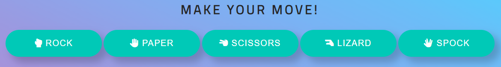

# Rock, Paper, Scissors, Lizard, Spock

Rock, Paper, Scissors, Lizard, Spock, invented by Sam Kass, is an adaptation of the traditional game of chance, Rock Paper Scissors. It was popularized by Dr. Sheldon Cooper from "The Big Bang Theory".

In "The Lizard-Spock Expansion" episode, it is first used to resolve a TV-watching disagreement between Sheldon and Raj.

- The rules for this game are:

The player picks a variable and reveals it at the same time as the pc. The winner is the one who gets 10 points first. In a tie, the process is repeated until a winner is found.

Scissors cuts Paper, Paper covers Rock, Rock crushes Lizard, Lizard poisons Spock, Spock smashes Scissors, Scissors decapitates Lizard, Lizard eats Paper, Paper disproves Spock, Spock vaporizes Rock, (and as it always has) Rock crushes Scissors.

The Live Game can be accessed [HERE!](https://carmencantudo.github.io/rock-paper-scissors-lizard-spock/)

 

## Table of Contents
- [Rock, Paper, Scissors, Lizard, Spock](#rock-paperscissors-lizardspock)
  - [Table of Contents](#table-of-contents)
  - [Features](#features)
    - [Existing Features](#existing-features)
    - [Future Features](#future-features)
  - [UX](#ux)
    - [Site Purpose](#site-purpose)
    - [Site Goal](#site-goal)
    - [Audience](#audience)
    - [Communication](#communication)
    - [Current User Goals](#current-user-goals)
    - [New User Goals](#new-user-goals)
    - [Site Administrator Goals](#site-administrator-goals)
  - [Design](#design)
    - [Colour Scheme](#colour-scheme)
    - [Typography](#typography)
    - [Imagery](#imagery)
    - [Wireframes](#wireframes)
  - [Testing](#testing)
    - [Validator Testing](#validator-testing)
  - [Technologies Used](#technologies-used)
    - [Main Languages Used](#main-languages-used)
    - [Frameworks, Libraries \& Programs Used](#frameworks-libraries--programs-used)

## Features
### Existing Features

 Header 

The Header at the top of the page features a contrasting font that makes it stand out, and it prominently displays the game's title.

 The Rules, Reset button and Score Area 

- Rules button:

The modal gives a short overview of the game rules.
The modal contains a close button, which the user can use to close it.

- Reset button:
  
When clicked it resets the scores to 0 and remove the choices and result from the game area.

- Scores area:

On the left is the player's score, which increases after each player win.
The right shows the computer's score, which also updates after each win.

 Choices Area 

The next section contains the game options that the player can select: Rock, Paper, Scissors, Lizard, Spock.
When the player clicks on one, the computer initiates an automatic random play.

To assist the user in learning the hand movements often associated with the game, the printed name and a Font Awesome icon are used to represent it.

Each button also includes a hoover and active element for the assistance of users.

 User vs Computer Area 

The left box displays the player's selected choice, while the right box displays the computers. This facilitates comparison.

The chosen option displays a humorous picture of the actual choice.

 Result message Area 

The winning decision based on the game's rules is also displayed after each round.
It's also beneficial for inexperienced users because they may learn the game's rules while they play.

### Future Features

- To store your scores and add a player name, click here.
- To ensure return and new visitors by sharing their high score or victories on social media.

[Back to top](#rock-paper-scissors-lizard-spock)

## UX
### Site Purpose

### Site Goal

### Audience

### Communication
The information is easily accessible to all visitors because of the website's straightforward design. Without having to conduct a thorough search, the information is readily available.

### Current User Goals

### New User Goals

### Site Administrator Goals

[Back to top](#rock-paper-scissors-lizard-spock)

## Design
### Colour Scheme
The colour scheme was designed to provide as much contrast as possible without becoming excessive. The accompanying imagery displayed across the site gives the majority of the colour.

### Typography
+ Playfair Display: Medium 500 Italic for quotes and regular 400 for titles.
+ Noto Sans: Light 300 for the body.
+ Special Elite: it mimics a typewriter and is used on the navigation menu.
+ Amiri: For book descriptions.

### Imagery
The site's images were gathered from free stock photo websites, and the sources are listed in the Credits section. Each photo provided supports the site's theme.

### Wireframes
- Desktop

- Tablet

- Mobile

[Back to top](#rock-paper-scissors-lizard-spock)

## Testing

- The website was constantly tested during development using Chrome dev tools.
- Tested all buttons.
- Website tested in Chrome, Firefox, Microsoft Edge and Brave.
- Lighthouse used to test webpage for Performance, Accessibility, Best Practices and SEO for desktop and mobile:
  

### Validator Testing
- HTML
  - No errors were returned when passing through the official [W3C validator](https://validator.w3.org/nu/?doc=https%3A%2F%2Fcarmencantudo.github.io%2Frock-paper-scissors-lizard-spock%2F).
  
- CSS
  - No errors were found when passing through the official [(Jigsaw) validator](https://jigsaw.w3.org/css-validator/validator?uri=https%3A%2F%2Fcarmencantudo.github.io%2Frock-paper-scissors-lizard-spock%2F&profile=css3svg&usermedium=all&warning=1&vextwarning=&lang=en).
  
-Javascript
  - JavaScript was tested using [Beautifytools](https://beautifytools.com/javascript-validator.php).
  

[Back to top](#rock-paper-scissors-lizard-spock)

## Technologies Used

### Main Languages Used
- HTML
- CSS
- JavaScript

### Frameworks, Libraries & Programs Used
- Gitpod: to create my Html files & styling sheet before pushing the project to GitHub.
- GitHub: to store my repository for submission.
- Balsamiq Wireframes: to make the wireframes for the website.
- Adobe Illustrator and Procreate: to create the logo.
- Google Fonts: for the font families, Amiri, Noto Sans, Playfair Display, Special Elite.
- Am I Responsive?: to ensure the project looked good across all devices.
- Cloudinary: to store, transform, optimise, and deliver the media assets.
- Markdown cheat sheet: to complete the Readme.

[Back to top](#rock-paper-scissors-lizard-spock)

